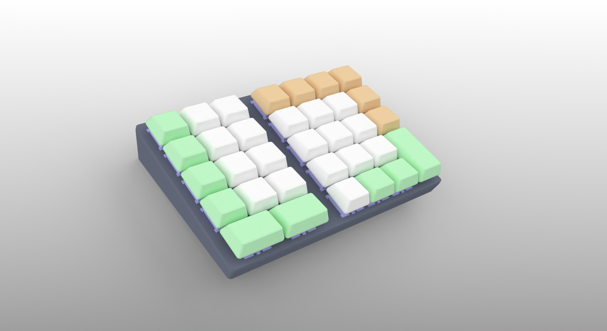

# Generalized_CAD
Generalized CAD Assistant Device, This is a programmable macro pad!

## 汎用型CAD（CADアシスタントデバイス）
CAD作業を行いやすくするための補助デバイス（マクロパッド）の制作データです。\
3Dプリントした部品とキースイッチやダイオード、ProMicro、WS2812などを組み合わせます。\
Vialに対応したファームウェアでキー設定をカスタマイズすることが可能です。

\
以下のデータを順次公開します。
* 3Dプリント用STLファイル（ケース、キーキャップ）
* VIAL対応ファームウェア
* 部品のリスト
* 回路の配線や組み立ての手順
\
## 右手はマウスを握ったまま、左手で数値やショートカットを入力したい。
* CAD作業時に左手で数値入力を行いたい。
* 修飾キーやショートカットを設定したい。
* 基盤をおこすのはハードルが高いので、回路は手配線で組む。
* カスタマイズしやすいように、3Dプリンターで製造したい。
* 大きさは、はがきサイズ（148*100mm）程度を目指す。
\
## 3Dプリント用STLファイル（ケース、キーキャップ）
[ケース](Cases)
* Case_v2025-01.stl
* LED-Plate.stl
* ProMicro_Lock.stl
\
[キーキャップ](Keycaps)
* KeyCap-Step_1U.stl
* KeyCap-Step_1.5U.stl
* KeyCap-Step_2U-H.stl
