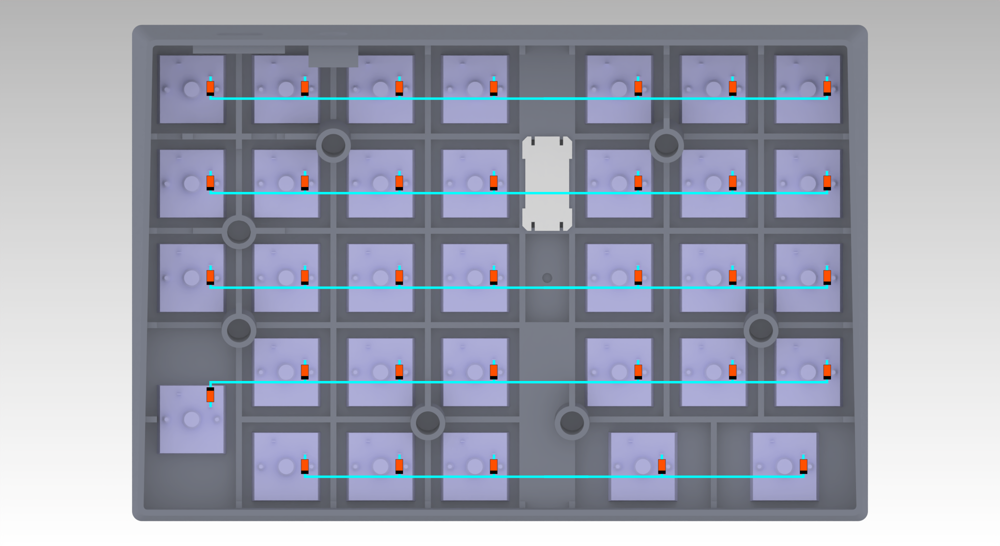
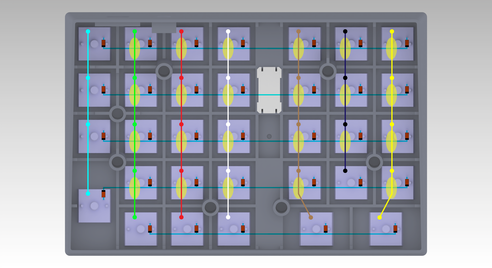
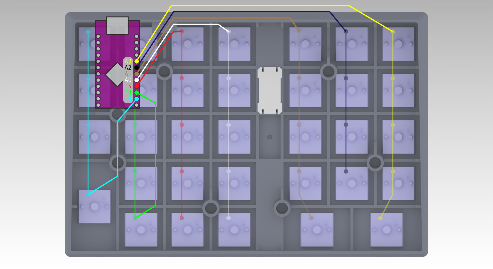
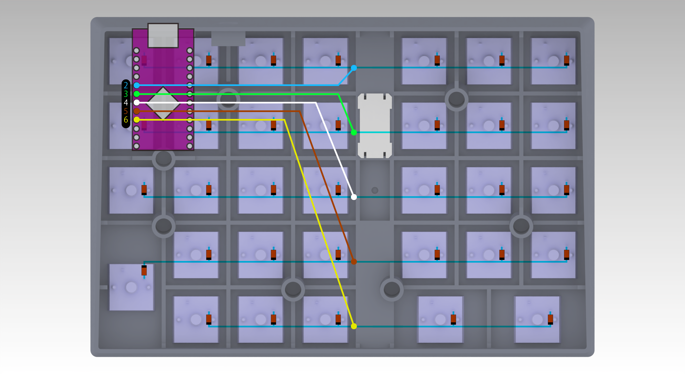
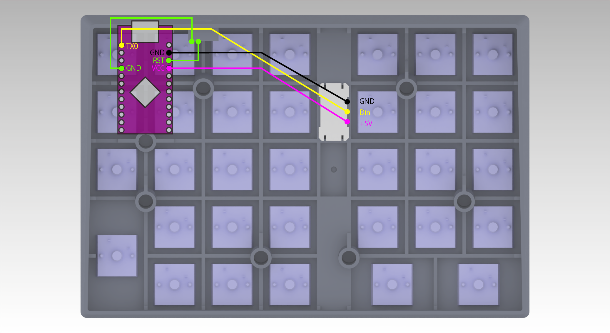

# Generalized_CAD
Generalized CAD Assistant Device, This is a programmable macro pad!

## 汎用型CAD（CADアシスタントデバイス）
CAD作業を行いやすくするための補助デバイス（マクロパッド）の制作データです。\
3Dプリントした部品とキースイッチやダイオード、ProMicro、WS2812などを組み合わせます。\
Vialに対応したファームウェアでキー設定をカスタマイズすることが可能です。
\
\
以下のデータを順次公開します。
* 3Dプリント用STLファイル（ケース、キーキャップ）
* VIAL対応ファームウェア
* 部品のリスト
* 回路の配線や組み立ての手順

## 開発にあたって
* 右手はマウスを握ったまま、左手で数値やショートカットを入力したい。
* 基盤をおこすのはハードルが高いので、回路は手配線で組む。
* カスタマイズしやすいように、3Dプリンターで製造したい。
* 大きさは、はがきサイズ（148*100mm）程度を目指す。

## 部品
### 3Dプリント用STLファイル（ケース、キーキャップ）
[ケース](Cases)\
Case_v2025-01.stl\
LED-Plate.stl\
ProMicro_Lock.stl\
BackPanel.stl\
レーザー加工の場合は BackPlate.ai\
\
[キーキャップ](Keycaps)\
KeyCap-Step_1U.stl\
KeyCap-Step_1.5U.stl\
KeyCap-Step_2U-H.stl

### 購入部品
参考としてAmazonの商品ページへのリンクも記載します。\
こちらで検証したものと同様の製品と思われるものを載せてはいますが、\
ロットや在庫などにより製品が異なるかもしれませんので注意してください。\
\
ProMicro ATmega32U4 USB-C [Amazon](https://www.amazon.co.jp/dp/B0B87D2FXZ)\
CherryMXと互換性のあるキースイッチ [Amazon](https://www.amazon.co.jp/dp/B0BYYWF14B)\
ダイオード [Amazon](https://www.amazon.co.jp/dp/B0BRQ5NNZS)\
WS2812のLEDテープ [Amazon](https://www.amazon.co.jp/dp/B088JWT7VT)\
タクトスイッチ [Amazon](https://www.amazon.co.jp/dp/B011XXVI80)\
配線用電線 [Amazon](https://www.amazon.co.jp/dp/B07GGZQXSF)\
熱圧入インサートナットM3 [Amazon](https://www.amazon.co.jp/dp/B09NNPWRH8)\
PC接続用USBケーブル [Amazon](https://www.amazon.co.jp/dp/B071D8THD2)\
クッションシール [Amazon](https://www.amazon.co.jp/dp/B01B4COI8W)

## 配線

ダイオードの向きに注意して、キースイッチを横方向にハンダ付けして接続します。\
\

ショートしないように配慮しながら、キースイッチを縦方向にハンダ付けして接続します。\
\

縦方向の接続線をProMicroのピンにハンダ付けします。\
\

横方向の接続線をProMicroのピンにハンダ付けします。\
\

リセット用タクトスイッチとWS2812LEDをProMicroのピンにハンダ付けします。\
目視や配線を揺らしてみたりして部品が外れないかを確認します。\
回路部分は、テスターなどでショートや接続不良がないかなどを確認すると良いでしょう。

## ファームウェアの書き込み
[ファームウェア](Firmware)
コンパイル済みVial対応ファームウェア\
naco_design_generalized_cad_vial.hex　をダウンロードします。\
\
Chromeで　[Pro Micro Web Updaterのサイト](https://sekigon-gonnoc.github.io/promicro-web-updater/index.html) を開きます。\
「ファイルを選択」のボタンからnaco_design_generalized_cad_vial.hexを開き、flashボタンをクリックします。\
「対応したデバイスが見つかりませんでした。」と表示されますので、リセット用タクトスイッチを押します。\
Arduino Microがあらわれるので、接続をクリック。ファームウェアが書き込まれます。

## 動作確認やカスタマイズ
[Vialのサイト](https://get.vial.today/)を開き、Start Vial Webから動作の確認やキー設定の変更が行えます。
